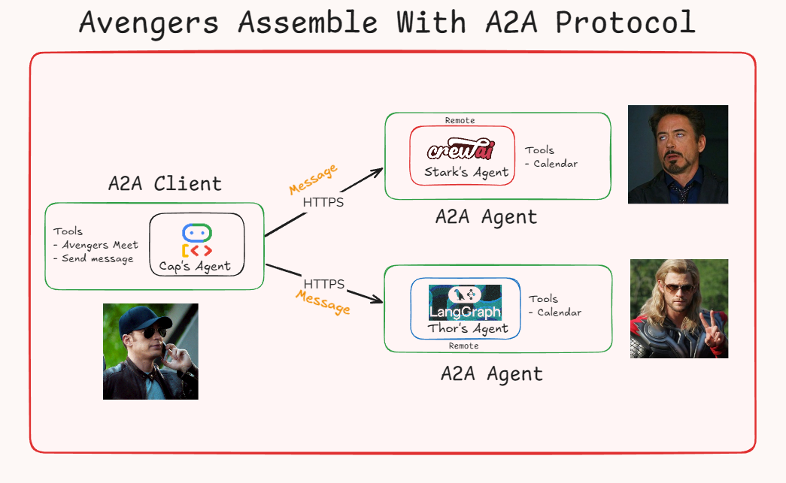

# Agentic AI Workflow Orchestration (A2A)

A multi-agent system demonstrating **Agent-to-Agent (A2A) communication**, where autonomous AI agents coordinate, negotiate constraints, and schedule shared resources using tool-driven workflows.

This project simulates a real-world coordination problem using a fun **Avengers-themed scenario**, while showcasing **production-relevant agentic AI patterns**.

---

### 📊 Workflow

---

### 🎯 Project Goal

To demonstrate how multiple AI agents, built using different agent frameworks, can:

- Communicate autonomously using A2A-style messaging
- Coordinate tasks across agents with isolated state
- Negotiate constraints (availability, conflicts)
- Use tools to make decisions
- Reduce manual coordination effort by approximately **50%**

---

### 🧠 Real-World Analogy

Similar to how human assistants collaborate to schedule meetings:

- Each agent owns its **own context, memory, and tools**
- A coordinator aggregates responses from multiple agents
- Decisions are made **collaboratively**, not through hard-coded logic

This mirrors real **enterprise agent orchestration** and workflow automation use cases.

---

### 🏗️ Architecture Overview

#### Agent Roles

| Agent | Framework | Role |
|------|----------|------|
| **Thor Agent** | LangChain | Manages Thor’s availability and responds to scheduling queries |
| **Stark Agent** | CrewAI | Manages Stark’s schedule and performs constraint negotiation |
| **Cap Agent** | Google ADK | Coordinates agents via A2A-style messaging and aggregates decisions |

---

### 🛠️ Technology Stack

- **A2A SDK** – Agent-to-Agent communication protocol  
- **Google ADK** – Agent Development Kit for building conversational agents (conceptual architecture)  
- **LangChain / LangGraph** – Framework for building LLM applications with memory and control flow  
- **CrewAI** – Multi-agent orchestration framework  
- **Vertex AI/Goggle Gemini** – Large Language Model for agent reasoning  
- **uv** – Fast Python package and environment manager  

---

### 🔑 Key Concepts Demonstrated

- Multi-agent system design
- Agent-to-Agent (A2A) communication
- Tool-augmented reasoning
- Decentralized decision-making
- Framework interoperability (LangChain + CrewAI)
- Stateful agent workflows

---

### 📌 Use Cases

- Meeting and resource scheduling
- Multi-assistant coordination
- Workflow automation
- Agentic AI system design for analytics and operations

---
